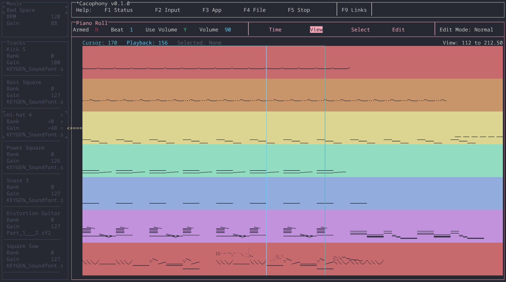

**Cacophony is a minimalist and ergonomic MIDI sequencer.** It's minimalist in that it doesn't have a lot of functionality MIDI sequencers have. It's ergonomic in that there is no mouse input and a very clean interface, allowing you to juggle less inputs and avoid awkward mouse motions.

I made Cacophony because I want to make music in a very particular way that I couldn't find anywhere.

Cacophony's mascot is Casey the Transgender Cacodemon. No official artwork of Casey exists because I don't want to be cursed.

## Documentation

- [Supported platforms](doc/platforms.md)
- [Setup](doc/setup.md)
- [Run](doc/run.md)
- [Compile](doc/compile.md)
- [Design manifesto](doc/manifesto.md)
- [Roadmap](doc/roadmap.md)
- [Limitations](doc/limitations.md)
- [Debug and test](doc/debug_and_test.md)